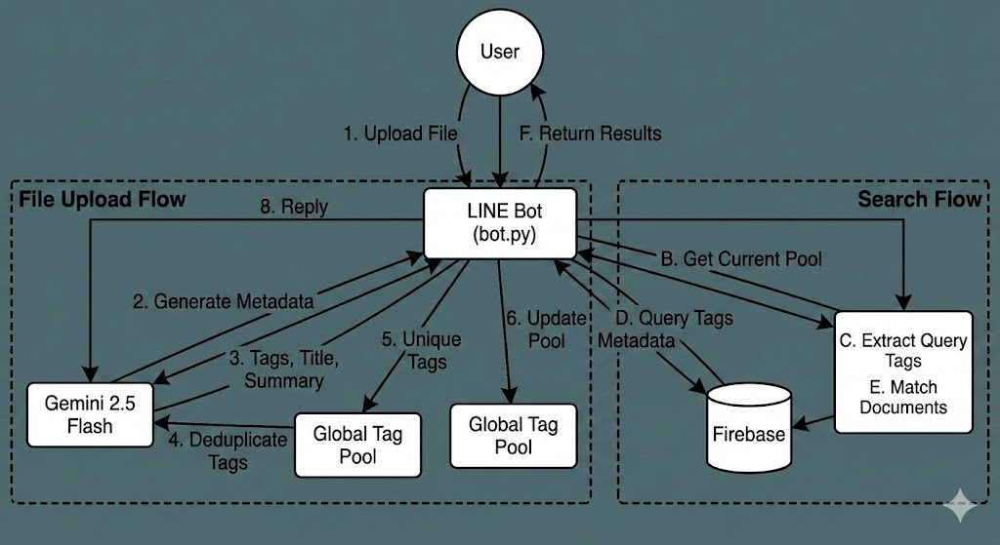

# Find-Dee Backend

This directory contains the backend logic for the Find-Dee LINE Bot, including the intelligent search and tagging system powered by Google Gemini.

## Features

### Intelligent Tagging & Summarization
- **Multimodal Analysis**: Uses **Gemini 2.5 Flash** to analyze uploaded images and PDFs directly.
- **Auto-Tagging**: Generates relevant tags for every uploaded file.
- **Summarization**: Creates a concise title and summary for the content.

### Dynamic Search
- **Natural Language Search**: Users can search using natural language (e.g., `/หาดี lecture notes`).
- **Query Understanding**: Extracts key tags from the user's query to match against stored documents.
- **Contextual Filtering**:
    - **Group Filter**: Automatically filters results to the current LINE group.
    - **Owner Filter**: Filters results to the user's own files in private chats.
- **Dynamic Tag Pool**:
    - Maintains a global pool of tags that grows as files are uploaded.
    - **Semantic Deduplication**: Automatically merges similar tags (e.g., "Math" and "Mathematics") to keep the pool clean and consistent.

## Architecture

### `bot.py`
The main entry point for the LINE Bot.
- Handles LINE events (Text, Image, File).
- Manages user state (e.g., waiting for file upload).
- Integrates with the `search` module to process files and handle search queries.
- Updates the global `tag_pool` dynamically upon every file upload.

### `search/` Module
- **`tagger.py`**: Handles interaction with Gemini to generate metadata (tags, title, summary) from files.
- **`deduplicator.py`**: Uses Gemini to semantically deduplicate lists of tags.
- **`search.py`**: 
    - Extracts search intent/tags from user queries.
    - Matches query tags against document tags using Jaccard similarity.
    - Filters documents by `group_id` and `owner_id`.

### FastAPI Service (`search/api.py`)
A standalone API service for tag generation and search logic testing.

**Endpoints:**
- `POST /tags/generate`: Generate tags from text.
- `POST /tags/deduplicate`: Deduplicate a list of tags.
- `POST /search`: Extract tags from a query and calculate match score against a tag pool.

#### Running the API
1. Navigate to `backend/search`:
   ```bash
   cd backend/search
   ```
2. Install dependencies:
   ```bash
   pip install -r requirements.txt
   ```
3. Start the server:
   ```bash
   python api.py
   ```
   The API will be available at `http://localhost:8000`.
   Interactive docs: `http://localhost:8000/docs`.

### Main Backend API (`main.py`)
The core API for the LINE Mini App and Bot.

**File Management:**
- `GET /api/files/{user_id}`: Get files for a user (personal + group files).
- `POST /api/upload`: Upload a file (multipart/form-data).
- `PUT /api/files/{file_id}`: Update file metadata.
- `DELETE /api/files/{file_id}`: Delete a file.

**Planner/Dates:**
- `POST /api/dates`: Create a new date/task.
- `GET /api/dates/{user_id}`: Get all dates for a user.
- `PUT /api/dates/{date_id}`: Update a date.
- `DELETE /api/dates/{date_id}`: Delete a date.

**LINE Webhook:**
- `POST /callback`: Handles incoming LINE events.

#### Running the Main Backend
```bash
cd backend
uvicorn main:app --reload --port 8001
```
Interactive docs: `http://localhost:8001/docs`.

## Configuration
- **Model**: `gemini-2.0-flash`
- **Thinking Tokens**: Disabled (`include_thoughts: False`) for lower latency.

## Usage
1.  **Upload**: Send an image or PDF to the bot. It will reply with generated tags.
2.  **Search**: Type `/หาดี [query]` to find related documents.

## System Diagram

